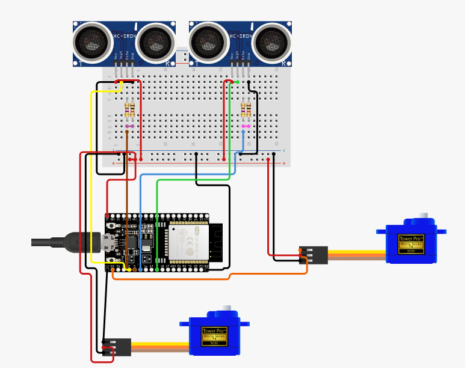
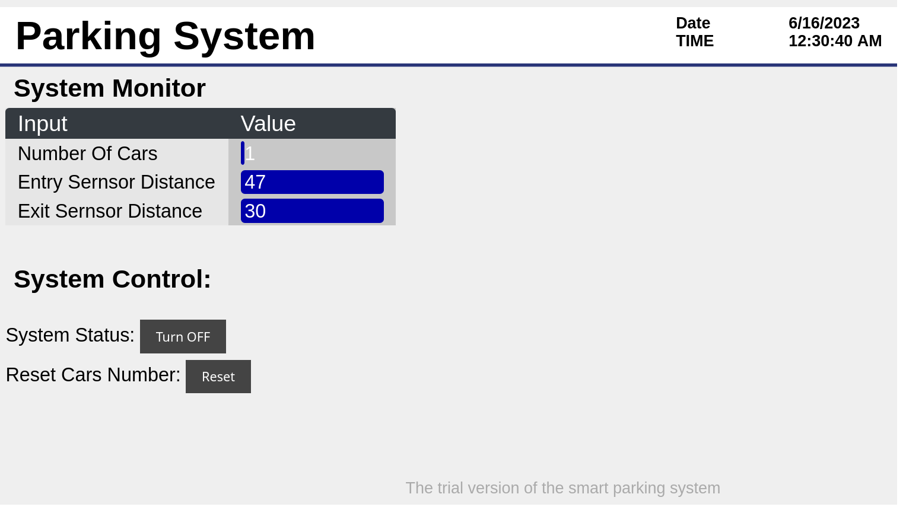

# 🚗 Smart Car Parking System with ESP32

<p align="center">
  
  <br>
  <em>System Block Diagram</em>
</p>

<p align="center">
  <strong>🅿️ An IoT-based smart parking system using an ESP32, ultrasonic sensors, and servo motors.</strong>
</p>

<p align="center">
  This project automates vehicle entry and exit, counts available spaces, and provides a real-time monitoring web server.
</p>

## ✨ About The Project

This is a complete embedded systems project that simulates a real-world parking management system. It uses an **ESP32 microcontroller** to create a local Wi-Fi network and host a web server. Ultrasonic sensors detect vehicles at the entry and exit gates, while servo motors control the physical barriers. The system provides real-time feedback on a web page, displaying the number of available parking spots.

### 🛠️ Built With

*   **Microcontroller:** ESP32
*   **Sensors:** 2x HC-SR04 Ultrasonic Distance Sensors
*   **Actuators:** 2x SG90 Micro Servo Motors
*   **Core Technology:** FreeRTOS (for real-time task management on the ESP32)
*   **Communication:** Built-in Wi-Fi & Web Server

## 🚀 Key Features

*   **Automated Gate Control:** Servo motors open and close gates when vehicles are detected.
*   **Vehicle Counting:** Tracks the number of cars entering and exiting to calculate available spots.
*   **Real-time Monitoring:** A dedicated web server displays the current parking status on any device connected to the ESP32's network.
*   **Dual-Sensor Logic:** Uses separate sensors for entry and exit to ensure accurate counting.
*   **Real-Time Operating System:** Leverages FreeRTOS for reliable and concurrent handling of sensor inputs and server tasks.

## 📦 Hardware Requirements

*   **ESP32** Development Board
*   **HC-SR04 Ultrasonic Sensor** x2
*   **SG90 Micro Servo** x2
*   Small Breadboard
*   Jumper Wires
*   Power Supply (5V capable)

## 🔌 Pin Connection Map

Connect the components to your ESP32 exactly as follows:

| Component Pin | Connects to ESP32 Pin |
| :--- | :--- |
| **Ultrasonic 1 - Trig** | GPIO 33 |
| **Ultrasonic 1 - Echo** | GPIO 25 |
| **Ultrasonic 1 - VCC** | 5V |
| **Ultrasonic 1 - GND** | GND |
| **Ultrasonic 2 - Trig** | GPIO 17 |
| **Ultrasonic 2 - Echo** | GPIO 16 |
| **Ultrasonic 2 - VCC** | 5V |
| **Ultrasonic 2 - GND** | GND |
| **Servo 1 - Signal** | GPIO 32 |
| **Servo 1 - VCC** | 5V |
| **Servo 1 - GND** | GND |
| **Servo 2 - Signal** | GPIO 19 |
| **Servo 2 - VCC** | 5V |
| **Servo 2 - GND** | GND |

## 🏁 Getting Started

Follow these instructions to get the project up and running on your own hardware.

### Prerequisites

*   **Arduino IDE** or **PlatformIO** (with ESP32 board support installed).
*   All hardware components listed above.

### Installation & Setup

1.  **Clone the repository**
    ```bash
    git clone https://github.com/O2sa/Car-Parking-System.git
    ```

2.  **Open the Code**
    *   Navigate to the `code/` directory.
    *   Open the main `.ino` file in your Arduino IDE (or the project in PlatformIO).

3.  **Configure Wi-Fi**
    *   In the code, find the section for Wi-Fi credentials.
    *   Replace `ssid` and `password` with your own network name and password.

4.  **Select Board and Port**
    *   In Arduino IDE, go to `Tools` > `Board` and select your specific ESP32 model.
    *   Select the correct `Port`.

5.  **Upload the Code**
    *   Connect your ESP32 via USB.
    *   Click the `Upload` button.

6.  **Assemble the Circuit**
    *   Carefully build the circuit on your breadboard following the **Pin Connection Map** above. Double-check all connections, especially power and ground, to avoid damaging components.

7.  **Power Up & Monitor**
    *   Once the code is uploaded, open the **Serial Monitor** (Tools > Serial Monitor) to see the ESP32's IP address.
    *   Open a web browser on any device connected to the same Wi-Fi network and navigate to that IP address to view the parking status.

## 💡 How It Works

1.  **Vehicle Detection:** When a car approaches the entry gate, the first ultrasonic sensor detects it.
2.  **Gate Control:** The ESP32 signals the entry servo to open the gate.
3.  **Counting Logic:** Once the car passes the sensor, the system increments the vehicle count (if space is available) and closes the gate. The exit sensor works similarly to decrement the count.
4.  **Web Server:** The ESP32 hosts a simple web page that displays the current number of available parking spots. This page updates in real-time as vehicles enter and exit.

## 🧪 Simulation

An online simulation of this project was created with **Circuito.io**. You can find the link in the repository's issues or consider re-sharing it for others.

## 📸 Screenshots

<p align="center">
  
  <br>
  <em>The monitoring web server interface.</em>
</p>

## ⚠️ Known Limitations & Future Ideas

### Current Limitations
*   **Object vs. Vehicle:** The ultrasonic sensor can detect any object, not just cars. A person or animal could trigger the gate.

### Ideas for Development
*   **Authentication:** Add an RFID reader or keypad for authorized entry only.
*   **Enhanced Web Interface:** Create a more advanced control panel to manually operate gates or view logs.
*   **Cloud Connectivity:** Send data to a cloud platform (like Blynk or AWS IoT) for remote monitoring.
*   **OLED Display:** Add a small screen to show spot availability directly on the unit.
*   **Improved Detection Logic:** Implement filtering or use two sensors per gate to better distinguish vehicles.

## 📚 References

1.  Jo, Y., & Jung, I. (2014). Analysis of vehicle detection with WSN-based ultrasonic sensors. _Sensors_, _14_(8), 14050–14069. [Link to paper]
2.  Stiawan, R., Kusumadjati, A., Aminah, N. S., Djamal, M., & Viridi, S. (2019). An ultrasonic sensor system for vehicle detection application. _Journal of Physics: Conference Series_, _1204_, 012017. [Link to paper]

## 🤝 Contributing

Contributions are what make the open-source community such an amazing place to learn, inspire, and create. Any contributions you make are **greatly appreciated**.

If you have a suggestion to improve the code, add features, or fix a bug:

1.  Fork the Project
2.  Create your Feature Branch (`git checkout -b feature/AmazingFeature`)
3.  Commit your Changes (`git commit -m 'Add some AmazingFeature'`)
4.  Push to the Branch (`git push origin feature/AmazingFeature`)
5.  Open a Pull Request
