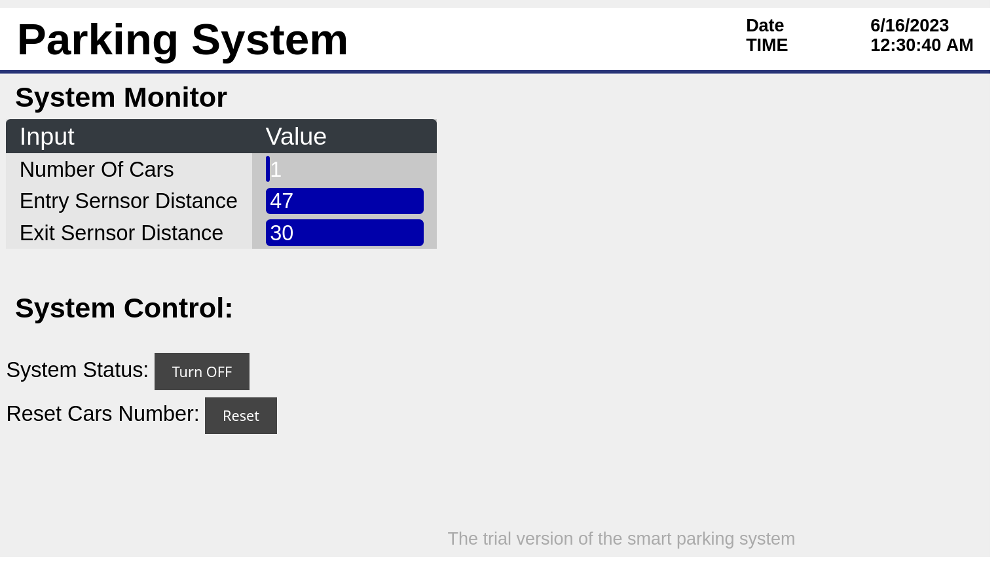

# Car-Parking-System
A smart parking system with web server using esp32 and ultrasonic

## About
Simple parking system with esp32 microcontroller that's have a lot of features like web server and wifi. And using  ultrasonic sensors to detect the cars and count them. and using servos to controller the exit and entry gates.

## Features of system 
- Two gates
- Realtime response
- A web server for monitoring the system

## Components
1. ESP32 Microcontroller
2. Ultrasonic distance sensor(HS-SR04) x2
3. Micro servo(SG90) x2
4. Small breadBoard

## Simulation
online simulation with [circuito.io](https://www.circuito.io/static/reply/index.html?solutionId=64893421c3831e002ef5cbb2&solutionPath=storage.circuito.io)

## Pins Map

Components Pins | ESP Pins
------------  | ------------
Ultrasonic one Trig pin | P23
Ultrasonic one Echo pin | P22
Ultrasonic one VCC pin | 5v
Ultrasonic one GND pin | gnd
Ultrasonic two Trig pin | 17
Ultrasonic two Echo pin | 16
Ultrasonic two VCC pin | 5v
Ultrasonic two GND pin | gnd
First servo input pin | 19
First servo VCC pin | 5v
First servo GND pin | gnd
Second servo input pin | 18
Second servo VCC pin | 5v
Second servo GND pin | gnd

## Screenshots

- web server
server code from [ Kris Kasprzak ](https://github.com/KrisKasprzak/ESP32_WebPage.git)

## Problems
- Distance sensors may sense the presence of an object, but not a car specifically.

## Ideas for development
- Add an authentication method
- Add a page to control the system in the web server

## References
1. Jo, Y., & Jung, I. (2014). Analysis of vehicle detection with WSN-based  ultrasonic sensors. _Sensors_, _14_(8), 14050–14069. [link](https://doi.org/10.3390/s140814050)
2. Stiawan, R., Kusumadjati, A., Aminah, N. S., Djamal, M., & Viridi, S. (2019). An ultrasonic sensor system for vehicle detection application. _Journal of Physics: Conference Series_, _1204_, 012017. [link]( https://doi.org/10.1088/1742-6596/1204/1/012017)
